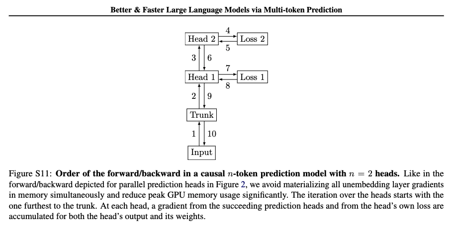

# GPT2MTP

This code supports an implementation of the causal variant of Multi-Token-Prediction as described in the [paper](https://arxiv.org/pdf/2404.19737) by Gloeckle et al. (Appendix B. Alternative Architectures).  For a visual explanation of the forward/backward implementation check Figure S11 below. 



To achieve this we need to have this line in the MTP loop: 
```
for i in reversed(range(model.n_future)): 
    # calculate logits and loss 
    # ...

    # accumulate gradients in the shared trunk *d.grad* and retain the 
    loss_i.backward(retain_graph=(i > 0)) 

# backward the accumulated gradient in the rest of the parameters 
z.backward(d.grad) 
```

More about the [`retain_graph`](https://stackoverflow.com/questions/46774641/what-does-the-parameter-retain-graph-mean-in-the-variables-backward-method) argument in the backward pass.

## HookedGPT2MTP

The GPT2MTP is built upon the `HookedTransformer` class from the [TransformerLens](https://transformerlensorg.github.io/TransformerLens/) library such that we can access intermediate activations in the Transformer and more important the MTP heads' activations. For that we slightly modified the `setup()` method of the `HookedRootModule` class in `hook_points.py` in order to identify and setup forward hooks on the MTP heads which are conveniently named `hook_mtp_heads.i` (where `i` is the number of MTP heads) for individual MTP activations and `hook_mtp_heads_out_pre` and `hook_mtp_heads_out_post` for the stacked tensor of MTP predictions pre/post LayerNorm.

Add the following line at the end of the `setup()` function in `HookedRootModule`: 
```
# Recursively call setup_hooks if the torch module has it
if hasattr(module, "setup_hooks"):
    module.setup_hooks(name)
```

## Setup

To download the dataset run: 

```
python data/open_web_text.py
```

## Train

To train the model with the GPT-2 Small configuration (with a slightly lower contex length of 256) and 4 MTP prediction heads run the following CLI command: 

```
python train.py > log_train_owt.txt 2>&1
```

1. for 1M /2 tokens per optimization step we can either set `n_ctx` to 256 with `batch_size` of 16 or `n_ctx` of 512 with `batch_size` of 8 and `n_ctx` of 1024 (GPT-2 Small) with `batch_size` of 4.

<details><summary>PyTorch utilities for training</summary>

1. Mixed Precision Training: 

- [Main Docs](https://pytorch.org/docs/stable/notes/amp_examples.html)
- [Gradient Scaling](https://pytorch.org/docs/stable/amp.html#gradient-scaling)

2. Compile: 

- https://pytorch.org/tutorials/intermediate/torch_compile_tutorial.html

3. Profiling: 

- https://pytorch.org/docs/stable/torch.compiler_profiling_torch_compile.html
- https://pytorch.org/tutorials/recipes/recipes/profiler_recipe.html
- https://pytorch.org/tutorials/intermediate/tensorboard_profiler_tutorial.html

The following save a trace of the forward pass through the mtp heads in a json that can be loaded at `chrome://tracing`: 
```
with profile(activities=activities, profile_memory=True, record_shapes=True) as prof2:
    with record_function("fwd_mtp_head"):
        mtp_resid_post = model.hook_mtp_heads[i](model.mtp_heads[i](d))    # (batch, seq_length, d_model)
# print(prof2.key_averages().table(sort_by=sort_by_keyword, row_limit=10))
prof2.export_chrome_trace(f"{profile_dir}/trace_fwd_mtp.json")
```

or just inline print table with: 

`print(prof2.key_averages().table(sort_by=sort_by_keyword, row_limit=10))`

</details>

## TODO: 

- [ ... ] Standard weight init (He or Xavier): 
    - https://www.deeplearning.ai/ai-notes/initialization/index.html
    - [Xavier](https://pytorch.org/docs/stable/nn.init.html#torch.nn.init.xavier_uniform_) 
    - [Kaiming](https://pytorch.org/docs/stable/nn.init.html#torch.nn.init.kaiming_uniform_) 
- [ ... ] How to tune [AdamW](https://arxiv.org/pdf/1711.05101) optimizer parameters (`max_lr`, `betas`, `weight_decay`) and [Cosine](https://pytorch.org/torchtune/0.3/generated/torchtune.modules.get_cosine_schedule_with_warmup.html) with [warmup](https://arxiv.org/pdf/1608.03983) Scheduler (`warmup_iters`) 
- [ X ] Update the forward pass for a manual bool kwarg for `return_all_mtp_heads`. If `True` keep the stacked tensor, if `False` keep only one head. look at https://huggingface.co/facebook/multi-token-prediction/blob/main/llama/model.py

Examples for training Transformers: 

1. [NanoGPT](https://github.com/karpathy/nanoGPT/blob/master/train.py) by Andrej Karpathy (other [repo](https://github.com/karpathy/build-nanogpt/blob/master/train_gpt2.py) for the YT tutorial)

2. [Delphi](https://github.com/delphi-suite/delphi/blob/main/delphi/train/training.py#L48) (also trains tokenizer with BPE similar to GPT-2 tokenizer)

3. [OLMo 2](https://github.com/allenai/OLMo-core?tab=readme-ov-file) by Ai2 ([blog](https://allenai.org/blog/olmo2-32B)): public train script at https://github.com/allenai/OLMo-core/blob/main/src/scripts/official/OLMo-2-0325-32B-train.py

4. [Transformer Birth](https://github.com/karpathy/nanoGPT/blob/master/train.py) paper
